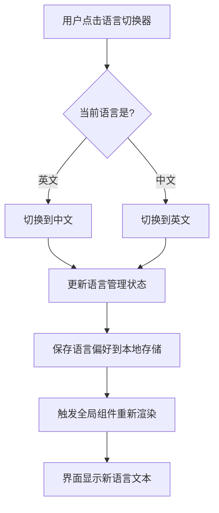
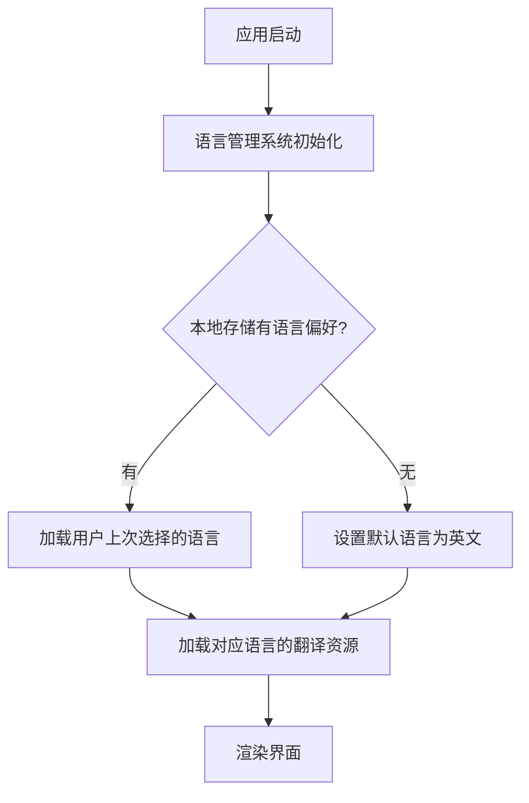

# 多语言支持功能设计文档

## 功能概述

为 KumoMTA-UI 项目添加中英文双语支持能力。系统默认显示英文界面,用户可以通过导航栏右上角的语言切换按钮在中文和英文之间自由切换,切换后的语言偏好将被持久化保存。

## 设计目标

- 提供流畅的双语切换体验,无需页面刷新
- 覆盖所有界面文本的国际化
- 语言选择状态持久化存储
- 保持现有界面设计风格的一致性
- 易于未来扩展更多语言

## 核心功能

### 1. 语言管理系统

系统需要提供统一的语言管理机制,包含以下职责:

- 维护当前激活的语言状态(中文/英文)
- 提供语言切换能力
- 将用户的语言偏好存储到浏览器本地存储
- 在应用启动时恢复用户上次选择的语言,若无历史记录则默认使用英文
- 向全局组件树提供语言上下文

### 2. 翻译资源结构

翻译资源按照界面模块进行组织,采用嵌套的键值对结构:

| 模块 | 说明 | 主要内容 |
|------|------|----------|
| 导航栏 | Navbar 组件相关文本 | Logo文本、导航菜单项、GitHub按钮文本 |
| 首页横幅 | Hero 组件相关文本 | 标签文本、主标题、副标题、CTA按钮、说明文字 |
| 功能特性 | Features 组件相关文本 | 板块标题、每个功能的标题和描述 |
| 技术栈 | TechStack 组件相关文本 | 板块标题、技术分类标题、技术描述 |
| 快速开始 | GettingStarted 组件相关文本 | 板块标题、步骤说明、代码注释文本 |
| 页脚 | Footer 组件相关文本 | 关于文本、快速链接、版权声明 |

翻译资源示例结构:

```
navbar:
  - logo: 品牌名称
  - features: 功能特性菜单项
  - gettingStarted: 快速开始菜单项
  - github: GitHub按钮文本
  
hero:
  - badges: 标签组(AI驱动、开源、生产就绪)
  - mainTitle: 主标题
  - subtitle: 副标题
  - ctaButtons: 行动号召按钮组
  - description: 说明文字
  
features:
  - sectionTitle: 板块标题
  - sectionSubtitle: 板块副标题
  - items: 功能列表(每项包含标题和描述)
  
footer:
  - about: 关于文本
  - quickLinks: 快速链接
  - copyright: 版权声明
```

### 3. 语言切换器组件

在导航栏右上角区域新增语言切换器,位于 GitHub 按钮之后:

**桌面端布局**:
- 显示为图标+文本的按钮形式
- 使用地球图标表示语言功能
- 显示当前语言的简称(EN/中)
- 点击时切换到另一语言
- 视觉样式与现有导航链接保持一致
- 支持悬停效果和平滑过渡动画

**移动端布局**:
- 集成到移动端侧边抽屉菜单中
- 放置在 GitHub 按钮下方
- 保持与其他菜单项一致的样式
- 点击后切换语言并保持菜单打开状态

### 4. 组件国际化改造

所有展示文本的组件需要从硬编码文本改为从翻译资源中读取:

**改造原则**:
- 每个组件通过语言管理系统访问对应的翻译文本
- 当语言状态变化时,组件自动重新渲染显示新语言的文本
- 保持现有组件结构和样式不变,仅替换文本内容
- 动态文本(如日期、年份)的格式化也需考虑本地化

**需要改造的组件清单**:
- Navbar.tsx: 导航链接文本、按钮文本
- Hero.tsx: 标签、标题、副标题、按钮、说明文字
- Features.tsx: 板块标题、功能列表
- TechStack.tsx: 板块标题、技术描述
- GettingStarted.tsx: 板块标题、步骤说明
- Footer.tsx: 关于信息、链接文本、版权声明

## 交互流程

### 语言切换流程



### 应用启动流程



## 数据管理

### 语言状态管理

| 属性 | 类型 | 说明 |
|------|------|------|
| 当前语言 | 枚举(en/zh) | 当前激活的语言代码 |
| 翻译资源 | 对象 | 包含所有语言的翻译文本 |
| 切换语言方法 | 函数 | 用于切换语言的操作方法 |

### 本地存储

| 键名 | 值类型 | 说明 |
|------|--------|------|
| language | 字符串 | 存储用户选择的语言代码(en/zh) |

### 翻译资源对照表示例

| 英文文本 | 中文文本 | 使用位置 |
|----------|----------|----------|
| Features | 功能特性 | 导航菜单 |
| Getting Started | 快速开始 | 导航菜单 |
| AI-Powered | AI驱动 | Hero标签 |
| Open Source | 开源 | Hero标签 |
| Production Ready | 生产就绪 | Hero标签 |
| Modern Web UI for KumoMTA | KumoMTA 的现代化 Web 管理界面 | Hero主标题 |
| Powerful Features | 强大的功能 | Features标题 |

## 技术策略

### 国际化方案选择

基于项目当前技术栈(React + TypeScript + Vite)和需求规模,采用轻量级的自建国际化方案:

**选择理由**:
- 项目仅需支持两种语言,复杂度可控
- 所有文本为静态内容,无需动态翻译
- 避免引入额外的第三方库,保持项目轻量
- 完全控制实现细节,易于定制

**核心机制**:
- 使用 React Context API 提供全局语言状态
- 使用 localStorage 持久化语言偏好
- 翻译资源以 TypeScript 对象形式管理,获得类型安全
- 自定义 Hook 简化组件中的翻译文本访问

### 状态管理方式

采用 React Context + Hooks 模式:

**Context 提供者**:
- 在应用根组件注入语言上下文
- 管理当前语言状态
- 提供切换语言的方法
- 提供访问翻译文本的方法

**自定义 Hook**:
- 封装访问翻译文本的逻辑
- 简化组件代码,提升开发体验
- 提供类型提示支持

### 组织结构

建议的文件组织方式:

```
src/
├── i18n/
│   ├── locales/
│   │   ├── en.ts          # 英文翻译资源
│   │   └── zh.ts          # 中文翻译资源
│   ├── LanguageContext.tsx # 语言上下文定义
│   ├── useTranslation.ts   # 自定义Hook
│   └── index.ts            # 统一导出
└── components/
    └── LanguageSwitcher.tsx # 语言切换器组件
```

## 视觉设计

### 语言切换器样式规范

**桌面端**:
- 位置: 导航栏右侧,GitHub 按钮之后
- 尺寸: 与导航链接保持一致
- 图标: 使用地球/语言图标
- 文本: 显示当前语言简称(EN/中)
- 颜色: 
  - 正常状态: 继承导航栏文本颜色
  - 悬停状态: 使用主题色(primary-600)
- 动画: 平滑的颜色过渡和下划线效果
- 间距: 与其他导航元素保持一致的间距

**移动端**:
- 位置: 侧边抽屉菜单内,GitHub 按钮下方
- 样式: 与其他菜单项保持一致
- 布局: 左对齐,带图标和文本
- 交互: 点击切换语言,菜单保持打开

### 过渡效果

语言切换时的视觉反馈:
- 文本内容平滑替换,无跳动
- 保持布局稳定性
- 切换器按钮状态即时更新
- 可选: 添加微妙的淡入淡出效果

## 质量保障

### 翻译完整性

- 确保所有界面文本都有对应的中英文翻译
- 翻译键值保持结构一致性
- 使用 TypeScript 类型检查确保翻译资源结构正确

### 用户体验

- 语言切换响应迅速,无明显延迟
- 切换后界面保持当前滚动位置
- 语言偏好持久化,刷新页面后保持
- 首次访问默认显示英文

### 兼容性

- 支持所有现代浏览器的 localStorage API
- 降级策略: 若 localStorage 不可用,仍能正常切换语言,只是不会持久化
- 响应式设计,在不同屏幕尺寸下都能正常使用语言切换器

### 可维护性

- 翻译资源与组件代码分离
- 使用统一的访问接口
- 类型安全的翻译键访问
- 清晰的文件组织结构
- 便于未来添加新语言

## 扩展性考虑

### 未来支持更多语言

当前架构设计支持轻松扩展到更多语言:
- 新增语言仅需添加新的翻译资源文件
- 语言切换器可升级为下拉菜单
- 核心语言管理系统无需修改

### 语言检测

可选的未来增强功能:
- 基于浏览器语言自动选择初始语言
- 基于地理位置推荐语言
- 记住用户的语言偏好跨设备同步(需后端支持)

## 实施优先级

### 高优先级
1. 创建语言管理系统和上下文
2. 准备完整的中英文翻译资源
3. 实现语言切换器组件
4. 改造 Navbar 和 Hero 组件

### 中优先级
5. 改造 Features 和 Footer 组件
6. 实现本地存储持久化
7. 完善移动端适配

### 低优先级
8. 添加切换动画效果
9. 优化性能和加载体验
10. 添加语言检测功能(可选)
